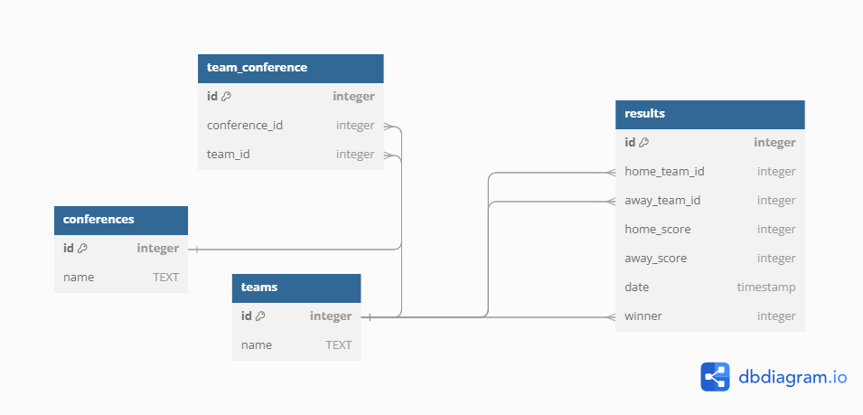

# Design Document

By Daniel Tavares

Video overview: <URL [https://youtu.be/J2xHLrb_8NQ]>

## Scope

The purpose of the database for NBA is to ease the process of analyzing team results trends in overall allowing to store results for NBA and allowing analysis like home vs away advantage, being in win % or average points. It also allows analysis of trend vs when playing the same conference or other conference, etc.
Included the scope of the database is:

* Teams
* Conferences
* Results, including scores, date and winner of each match

Out of scope is other statistics like divisions, player performance, period performance and other in-depth data.

## Functional Requirements

This database will support:
* Analysis of home vs away advantage trend
* Analysis of teams results trend
* Adding further fixtures/results as needed

## Representation

Entities are captured in SQLite tables with the following schema.

### Entities

The database includes the following entities:

#### Conferences

The `conferences` table includes:
* `id`, which specifies the unique ID for the conference as an `INTEGER` (Primary Key)
* `name`, which specifies conference name as `TEXT` and `UNIQUE` as there should be no repeated conferences

#### Teams

The `teams` table includes:
* `id`, which specifies the unique ID for the team as an `INTEGER` (Primary Key)
* `name`, which specifies teams name as `TEXT` and `UNIQUE` as there should be no repeated teams.

#### Results

The `results` table includes:
* `id`, which specified the unique ID for each match as an `INTEGER` (Primary Key)
* `home_team_id`, which is the ID of the team that is playing at home as an `INTEGER`. This column has the `FOREIGN KEY` constraint applied, referencing the `id` column in the `teams` table to ensure data integrity.
* `away_team_id`, which is the ID of the team that is playing at away as an `INTEGER`. This column has the `FOREIGN KEY` constraint applied, referencing the `id` column in the `teams` table to ensure data integrity.
* `home_score`, which is the points of the home team as an `INTEGER`.
* `away_score`, which is the points fo the away team as an `INTEGER`.
* `date`, which is the date the game was played as `TIMESTAMP`.
* `winner`, which is the ID of the team that won the game as an `INTEGER`. This column has the `FOREIGN KEY` constraint applied, referencing the `id` column in the `teams` table to ensure data integrity.

### Relationships

The below entity relationship diagram describes the relationships among the entities in the database.

As detailed by the diagram:

* A conference can have several teams, but each team can only have one conference entailing a one-to-many relationship
* A result is associated with two teams. One home team and an away team, with the result between these two teams determining the winner. `Triggers` were created to generate winner automatically upon insertion or update of results. Each team will have many results and can appear as winner several times.

## Optimizations

* `VIEW` was create to easily see results of each team by name, as this is one of the main objectives of this database.
* Typical queries will be around the `results` table, therefore several indexes were created around the data present here, as home_team_id, away_team_id, date and winner.
* It is possible for some queries to be around the `conference` of each a team, so a INDEX for this was also created.
* To ease access, in the `queries.sql` besides the most common queries, there is an example on how to populate the database tables, with the import statement from a `.csv` file. In this case, data was imported from "https://www.basketball-reference.com/leagues/NBA_2025_games-december.html"

## Limitations

* The current schema is limited when taken into account the size of the NBA universe. For deeper analysis of trends further data would have to be employed, such as player performance, period-to-period performance and divisions of each team for example.
* Although there is a date associated with games it may not allow separation by season, thus this database is more appropriated to season-by-season analysis.

